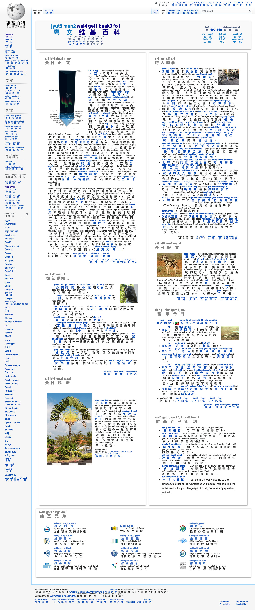

<h1>Inject Jyutping <ruby>幫<rt>bong1</rt></ruby> <ruby>漢<rt>hon3</rt></ruby> <ruby>字<rt>zi6</rt></ruby> <ruby>標<rt>biu1</rt></ruby> <ruby>粵<rt>jyut6</rt></ruby> <ruby>拼<rt>ping3</rt></ruby></h1>

呢個係一個可以幫網頁上面嘅漢字自動標註粵拼嘅 Chrome、Firefox 同 Edge 擴充功能，係學習粵拼同粵語嘅強大工具。

A browser extension for Google Chrome, Mozilla Firefox, and Microsoft Edge that adds Cantonese pronunciation (Jyutping) on Chinese characters, a powerful tool for learning Cantonese and Jyutping.

<h2>Install <ruby>安<rt>on1</rt></ruby> <ruby>裝<rt>zong1</rt></ruby></h2>

-   [Chrome Web Store](https://chrome.google.com/webstore/detail/inject-jyutping/lfgpgjkjglogbndlkikjgbbfoiofbdjp)
-   [Firefox Browser Add-On](https://addons.mozilla.org/firefox/addon/inject-jyutping/)

<h2>Preview <ruby>預<rt>jyu6</rt></ruby> <ruby>覽<rt>laam5</rt></ruby></h2>

